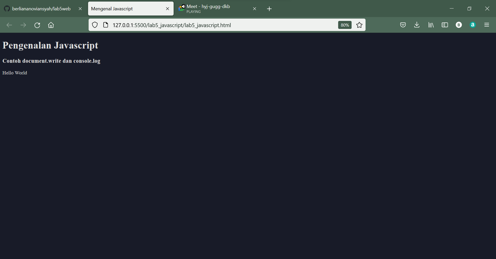
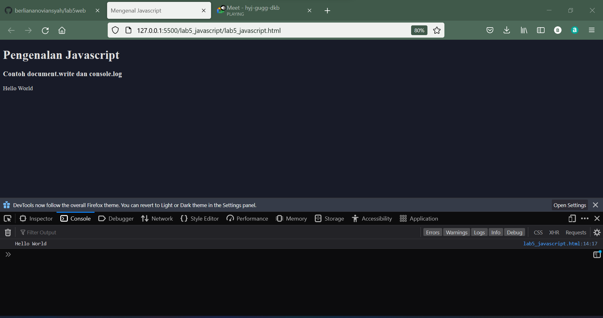
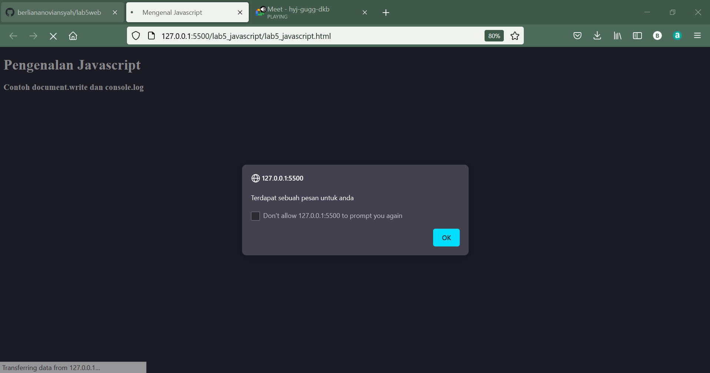
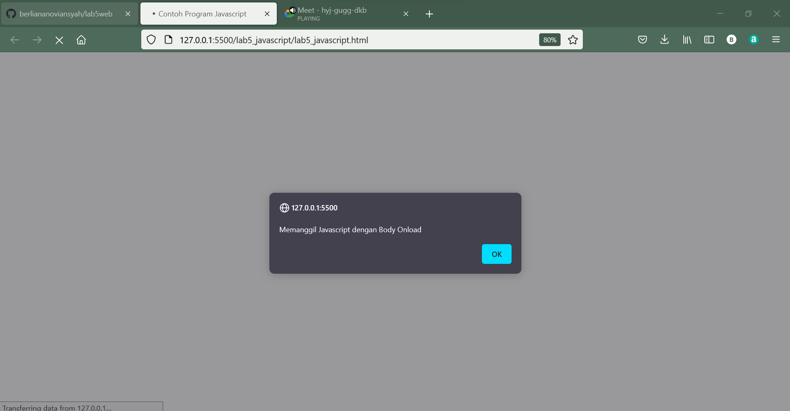
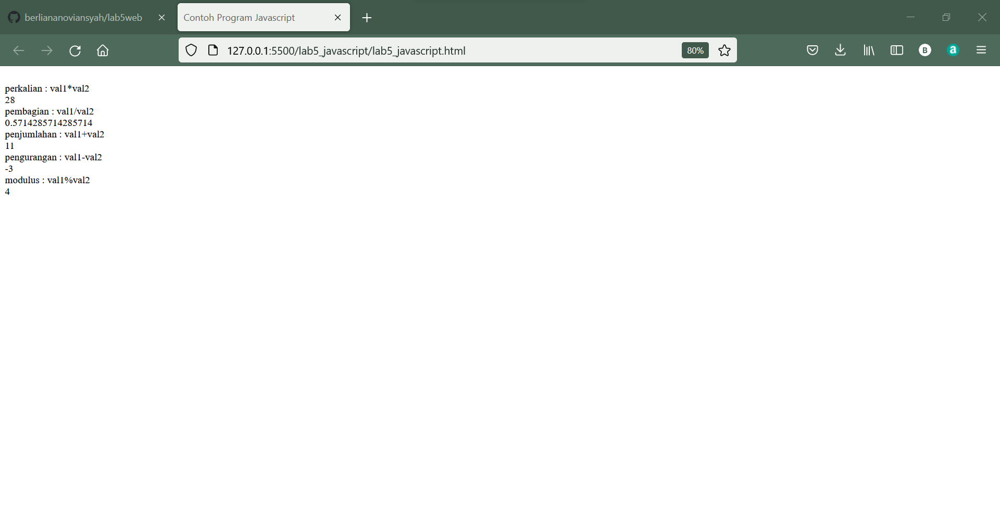
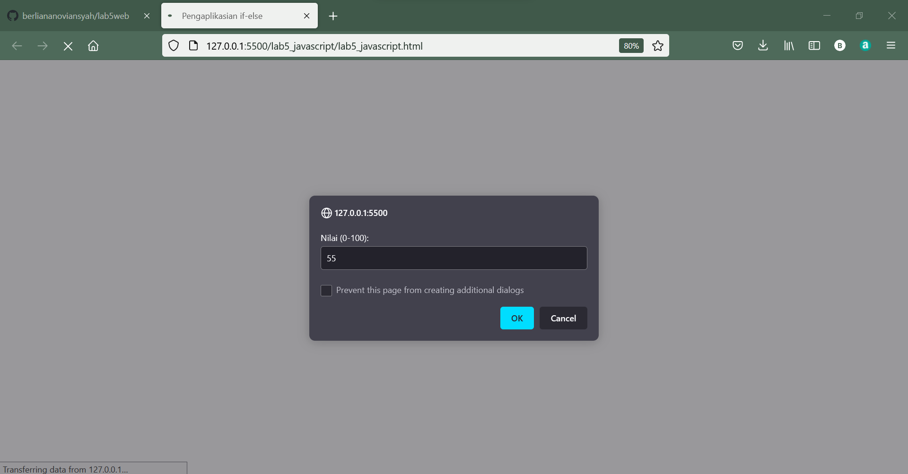
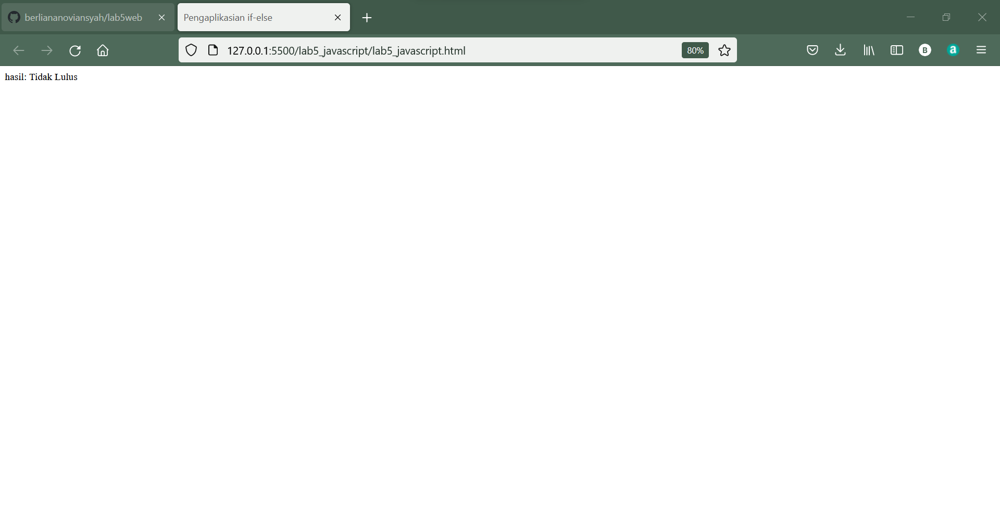
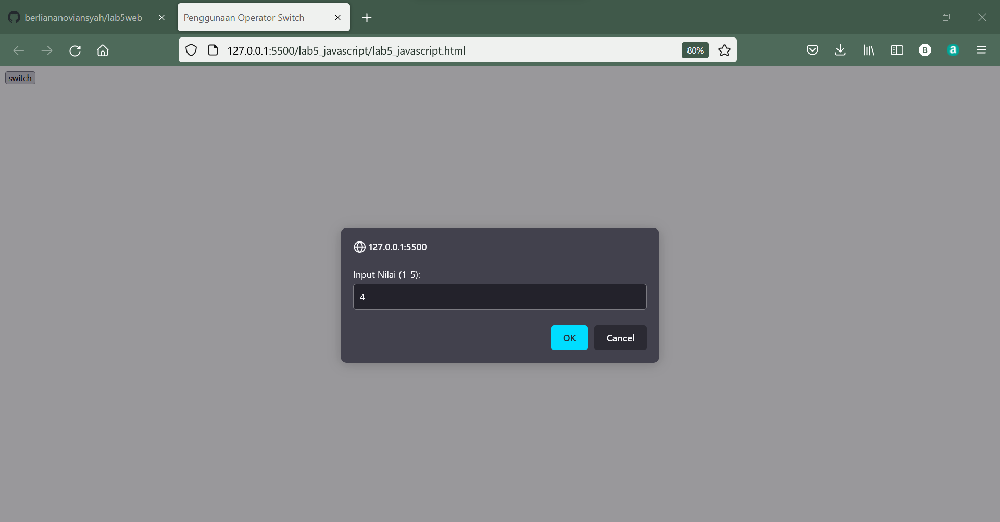

|  Berliana Noviansyah  |   312010373   |
|-----------------------|---------------|
|    Pemrograman Web    |    TI.20.A1   |
|      Pertemuan 6      |  Praktikum 5  |

# Praktikum 5 Pertemuan 6


## 1). Persiapan Membuat Dokmen HTML dengn Nama File lab5_javascript.html.

**Untuk coding dan outputnya adalah sebagai berikut:**

```html
<!DOCTYPE html>
<html lang="en">
<head>
    <meta charset="UTF-8">
    <meta http-equiv="X-UA-Compatible" content="IE=edge">
    <meta name="viewport" content="width=device-width, initial-scale=1.0">
    <title>Mengenal Javascript</title>
</head>
<body>
    <h1>Pengenalan Javascript</h1>
    <h3>Contoh document.write dan console.log</h3>
    <script>
        document.write("Hello World");
        console.log("Hello World");
    </script>
</body>
</html>
```

**Output:**



Untuk console.log tidak ditampilakn pada browser karena bersifat hidden element. Untuk melihatnya klik kanan, pilih inspect lalu buka pada bagian console.




# Javascript Dasar
## 2). Pemakaian Alert Sebagai Property Window

**Coding dan tampilan output:**

```html
!DOCTYPE html>
<html lang="en">
<head>
    <meta charset="UTF-8">
    <meta http-equiv="X-UA-Compatible" content="IE=edge">
    <meta name="viewport" content="width=device-width, initial-scale=1.0">
    <title>Mengenal Javascript</title>
</head>
<body>
    <h1>Pengenalan Javascript</h1>
    <h3>Contoh document.write dan console.log</h3>
    <script lang="javascipt">
        window.alert("Terdapat sebuah pesan untuk anda")
    </script>
</body>
</html>
```

**Output:**




## 3). Pemakaian Method Dalam Obyek

**Coding:**

```html
!DOCTYPE html>
<html lang="en">
<head>
    <meta charset="UTF-8">
    <meta http-equiv="X-UA-Compatible" content="IE=edge">
    <meta name="viewport" content="width=device-width, initial-scale=1.0">
    <title>Script Javascript</title>
</head>
<body>
    Percobaan Menggunakan Javascript:<br>
    <script lang="javascript">
        document.write("Belajar Menggunakan Javascript<br>");
        document.write("Good Luck!^^");
    </script>
</body>
</html>
```

**Output:**


## 4). Pengaplikasian Prompt

**Coding:**

```html
<!DOCTYPE html>
<html lang="en">
<head>
    <meta charset="UTF-8">
    <meta http-equiv="X-UA-Compatible" content="IE=edge">
    <meta name="viewport" content="width=device-width, initial-scale=1.0">
    <title>Script Javascript</title>
</head>
<body>
    Percobaan Menggunakan Javascript:<br>
    <script lang="javascript">
       var nama = prompt("What is your name?","Enter your name here");
       document.write("Hi, "+nama)
    </script>
</body>
</html>
```

**Output:**


## 5). Pembuatan Fungsi dan Cara pengaplikasiannya

**Coding:**

```html
<!DOCTYPE html>
<html lang="en">
<head>
    <meta charset="UTF-8">
    <meta http-equiv="X-UA-Compatible" content="IE=edge">
    <meta name="viewport" content="width=device-width, initial-scale=1.0">
    <title>Contoh Program Javascript</title>
    <script lang="javascript">
        function pesan(){
            alert ("Memanggil Javascript dengan Body Onload")
        }
    </script>
</head>
<body onload=pesan()>
    
   
</body>
</html>
```

**Outputnya:**




# Dasar Pemrograman pada Javascript


## 6). Operasi Dasar Aritmatika


**Coding:**

```html
<!DOCTYPE html>
<html lang="en">
<head>
    <meta charset="UTF-8">
    <meta http-equiv="X-UA-Compatible" content="IE=edge">
    <meta name="viewport" content="width=device-width, initial-scale=1.0">
    <title>Contoh Program Javascript</title>
    <script lang="javascript">
        function test (val1,val2)
        {
            document.write("<br>"+"perkalian : val1*val2 "+"<br>")
            document.write(val1*val2)
            document.write("<br>"+"pembagian : val1/val2 "+"<br>")
            document.write(val1/val2)
            document.write("<br>"+"penjumlahan : val1+val2 "+"<br>")
            document.write(val1+val2)
            document.write("<br>"+"pengurangan : val1-val2 "+"<br>")
            document.write(val1-val2)
            document.write("<br>"+"modulus : val1%val2 "+"<br>")
            document.write(val1%val2)
        }
    </script>
</head>
<body>
    <input type="button" name="button1" value="arithmetic" onclick=test(4,7)>
</body>
</html>
```


**Output:**




## 7). Seleksi Kondisi (IF/ELSE)

**Coding:**

```html
<!DOCTYPE html>
<html lang="en">
<head>
    <meta charset="UTF-8">
    <meta http-equiv="X-UA-Compatible" content="IE=edge">
    <meta name="viewport" content="width=device-width, initial-scale=1.0">
    <title>Pengaplikasian if-else</title>
</head>
<body>
    <script lang="javascript">
        var nilai = prompt("Nilai (0-100):", 0);
        var hasil = "";
        if (nilai >59)
        hasil = "Lulus";
        else
        hasil = "Tidak Lulus";
        document.write("hasil: "+hasil);
    </script>
</body>
</html>
```


**Output:**



Karena nilai yang dimasukkan adalah "55" dengan minimal nilai untuk lulus adalah "59", maka hasilnya adalah "Tidak Lulus"




## 8). Penggunaan Operator Switch untuk Seleksi Kondisi


**Coding:**

```html
<!DOCTYPE html>
<html lang="en">
<head>
    <meta charset="UTF-8">
    <meta http-equiv="X-UA-Compatible" content="IE=edge">
    <meta name="viewport" content="width=device-width, initial-scale=1.0">
    <title>Penggunaan Operator Switch</title>
    <script lang="javascript">
        function test ()
        {
            val1=window.prompt("Input Nilai (1-5):")
            switch (val1)
            {
                case "1":
                    document.write("Bilangan Satu")
                    break
                case "2":
                    document.write("Bilangan Dua")
                    break
                case "3":
                    document.write("Bilangan Tiga")
                    break
                case "4":
                    document.write("Bilangan Empat")
                    break
                case "5":
                    document.write("Bilangan Lima")
                    break
                default :
                    document.write("Bilangan Lainnya")
            }
        }

    </script>
    
</head>
<body>
    <input type="button" name="button1" value="switch" onclick=test()>
</body>
</html>
```

**Output:**




Dengan hasil sebagi berikut:


