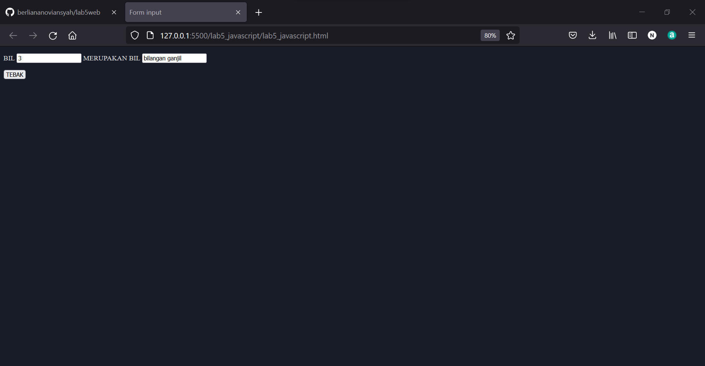
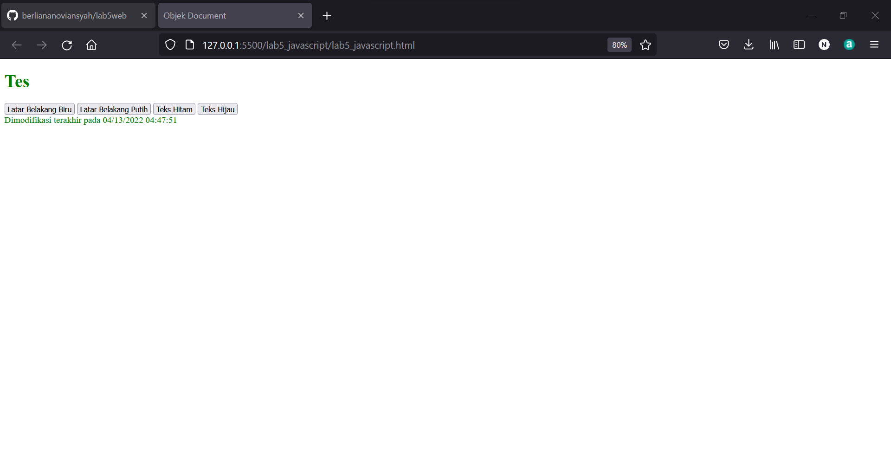
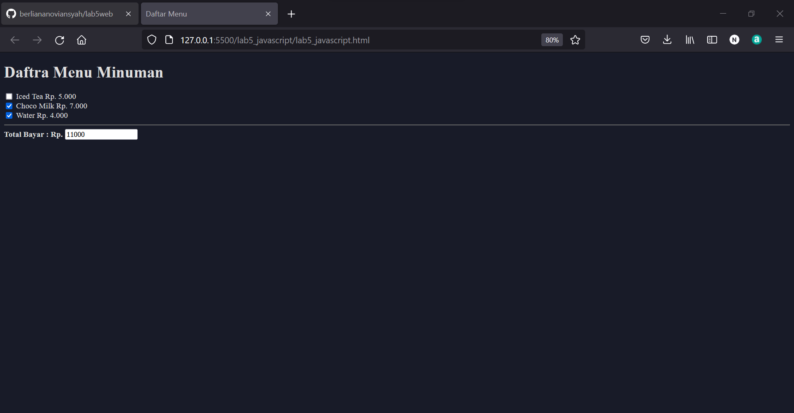
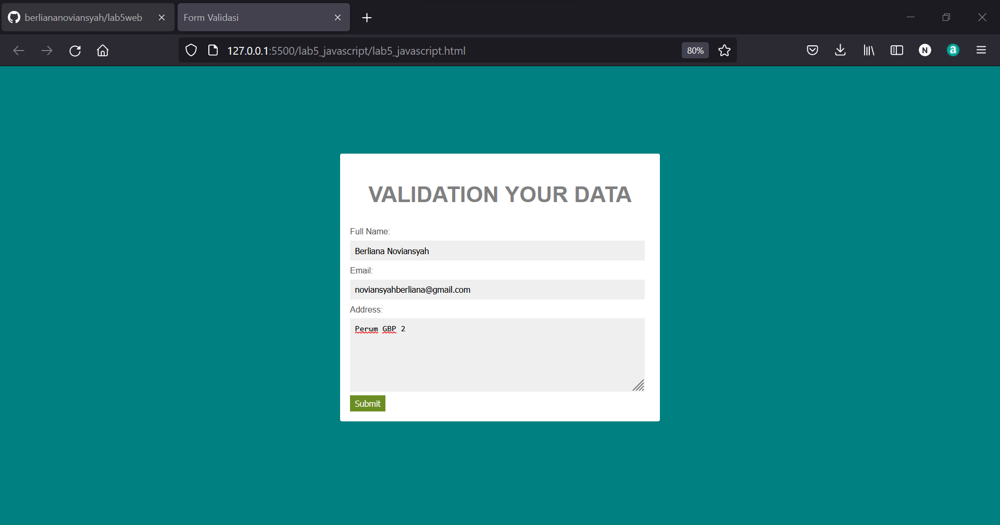
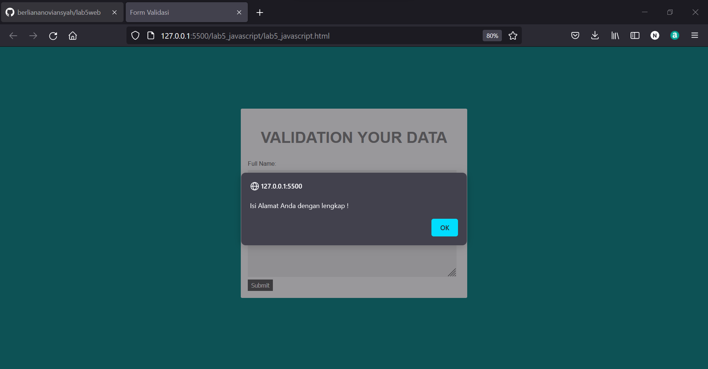

|  Berliana Noviansyah  |   312010373   |
|-----------------------|---------------|
|    Pemrograman Web    |    TI.20.A1   |
|      Pertemuan 6      |  Praktikum 5  |

# Praktikum 5 Pertemuan 6


## 1). Persiapan Membuat Dokmen HTML dengn Nama File lab5_javascript.html.

**Untuk coding dan outputnya adalah sebagai berikut:**

```html
<!DOCTYPE html>
<html lang="en">
<head>
    <meta charset="UTF-8">
    <meta http-equiv="X-UA-Compatible" content="IE=edge">
    <meta name="viewport" content="width=device-width, initial-scale=1.0">
    <title>Mengenal Javascript</title>
</head>
<body>
    <h1>Pengenalan Javascript</h1>
    <h3>Contoh document.write dan console.log</h3>
    <script>
        document.write("Hello World");
        console.log("Hello World");
    </script>
</body>
</html>
```

**Output:**


Untuk console.log tidak ditampilakn pada browser karena bersifat hidden element. Untuk melihatnya klik kanan, pilih inspect lalu buka pada bagian console.


# Javascript Dasar
## 2). Pemakaian Alert Sebagai Property Window

**Coding dan tampilan output:**

```html
!DOCTYPE html>
<html lang="en">
<head>
    <meta charset="UTF-8">
    <meta http-equiv="X-UA-Compatible" content="IE=edge">
    <meta name="viewport" content="width=device-width, initial-scale=1.0">
    <title>Mengenal Javascript</title>
</head>
<body>
    <h1>Pengenalan Javascript</h1>
    <h3>Contoh document.write dan console.log</h3>
    <script lang="javascipt">
        window.alert("Terdapat sebuah pesan untuk anda")
    </script>
</body>
</html>
```

**Output:**


## 3). Pemakaian Method Dalam Obyek

**Coding:**

```html
!DOCTYPE html>
<html lang="en">
<head>
    <meta charset="UTF-8">
    <meta http-equiv="X-UA-Compatible" content="IE=edge">
    <meta name="viewport" content="width=device-width, initial-scale=1.0">
    <title>Script Javascript</title>
</head>
<body>
    Percobaan Menggunakan Javascript:<br>
    <script lang="javascript">
        document.write("Belajar Menggunakan Javascript<br>");
        document.write("Good Luck!^^");
    </script>
</body>
</html>
```

**Output:**


## 4). Pengaplikasian Prompt

**Coding:**

```html
<!DOCTYPE html>
<html lang="en">
<head>
    <meta charset="UTF-8">
    <meta http-equiv="X-UA-Compatible" content="IE=edge">
    <meta name="viewport" content="width=device-width, initial-scale=1.0">
    <title>Script Javascript</title>
</head>
<body>
    Percobaan Menggunakan Javascript:<br>
    <script lang="javascript">
       var nama = prompt("What is your name?","Enter your name here");
       document.write("Hi, "+nama)
    </script>
</body>
</html>
```

**Output:**


## 5). Pembuatan Fungsi dan Cara pengaplikasiannya

**Coding:**

```html
<!DOCTYPE html>
<html lang="en">
<head>
    <meta charset="UTF-8">
    <meta http-equiv="X-UA-Compatible" content="IE=edge">
    <meta name="viewport" content="width=device-width, initial-scale=1.0">
    <title>Contoh Program Javascript</title>
    <script lang="javascript">
        function pesan(){
            alert ("Memanggil Javascript dengan Body Onload")
        }
    </script>
</head>
<body onload=pesan()>
    
   
</body>
</html>
```

**Outputnya:**


# Dasar Pemrograman pada Javascript


## 6). Operasi Dasar Aritmatika


**Coding:**

```html
<!DOCTYPE html>
<html lang="en">
<head>
    <meta charset="UTF-8">
    <meta http-equiv="X-UA-Compatible" content="IE=edge">
    <meta name="viewport" content="width=device-width, initial-scale=1.0">
    <title>Contoh Program Javascript</title>
    <script lang="javascript">
        function test (val1,val2)
        {
            document.write("<br>"+"perkalian : val1*val2 "+"<br>")
            document.write(val1*val2)
            document.write("<br>"+"pembagian : val1/val2 "+"<br>")
            document.write(val1/val2)
            document.write("<br>"+"penjumlahan : val1+val2 "+"<br>")
            document.write(val1+val2)
            document.write("<br>"+"pengurangan : val1-val2 "+"<br>")
            document.write(val1-val2)
            document.write("<br>"+"modulus : val1%val2 "+"<br>")
            document.write(val1%val2)
        }
    </script>
</head>
<body>
    <input type="button" name="button1" value="arithmetic" onclick=test(4,7)>
</body>
</html>
```


**Output:**


## 7). Seleksi Kondisi (IF/ELSE)

**Coding:**

```html
<!DOCTYPE html>
<html lang="en">
<head>
    <meta charset="UTF-8">
    <meta http-equiv="X-UA-Compatible" content="IE=edge">
    <meta name="viewport" content="width=device-width, initial-scale=1.0">
    <title>Pengaplikasian if-else</title>
</head>
<body>
    <script lang="javascript">
        var nilai = prompt("Nilai (0-100):", 0);
        var hasil = "";
        if (nilai >59)
        hasil = "Lulus";
        else
        hasil = "Tidak Lulus";
        document.write("hasil: "+hasil);
    </script>
</body>
</html>
```


**Output:**


Karena nilai yang dimasukkan adalah "55" dengan minimal nilai untuk lulus adalah "59", maka hasilnya adalah "Tidak Lulus"


## 8). Penggunaan Operator Switch untuk Seleksi Kondisi


**Coding:**

```html
<!DOCTYPE html>
<html lang="en">
<head>
    <meta charset="UTF-8">
    <meta http-equiv="X-UA-Compatible" content="IE=edge">
    <meta name="viewport" content="width=device-width, initial-scale=1.0">
    <title>Penggunaan Operator Switch</title>
    <script lang="javascript">
        function test ()
        {
            val1=window.prompt("Input Nilai (1-5):")
            switch (val1)
            {
                case "1":
                    document.write("Bilangan Satu")
                    break
                case "2":
                    document.write("Bilangan Dua")
                    break
                case "3":
                    document.write("Bilangan Tiga")
                    break
                case "4":
                    document.write("Bilangan Empat")
                    break
                case "5":
                    document.write("Bilangan Lima")
                    break
                default :
                    document.write("Bilangan Lainnya")
            }
        }

    </script>
    
</head>
<body>
    <input type="button" name="button1" value="switch" onclick=test()>
</body>
</html>
```

**Output:**


Dengan hasil sebagi berikut:


# Pembuatan Form


## 9). Form Input

**Coding:**

```html
<!DOCTYPE html>
<html lang="en">
<head>
    <meta charset="UTF-8">
    <meta http-equiv="X-UA-Compatible" content="IE=edge">
    <meta name="viewport" content="width=device-width, initial-scale=1.0">
    <title>Form input</title>
    <script lang="javascript">
        function test () {
            var val1=document.kirim.T1.value
            if (val1%2==0)
                document.kirim.T2.value="bilangan genap"
            else
                document.kirim.T2.value="bilangan ganjil"
        }
    </script>
</head>
<body>
    <form action="" method="post" name="kirim">
        <p>BIL <input type="text" name="T1" id="T1" size="20"> MERUPAKAN BIL <input type="text" name="T2" id="T2" size="20"></p>
        <p><input type="button" value="TEBAK" name="B1" onclick=test()></p>
    </form>
</body>
</html>
```


**Output:**




## 10). Form Button

**Coding:**

```html
<!DOCTYPE html>
<html lang="en">
<head>
    <meta charset="UTF-8">
    <meta http-equiv="X-UA-Compatible" content="IE=edge">
    <meta name="viewport" content="width=device-width, initial-scale=1.0">
    <title>Objek Document</title>
</head>
<body>
    <script lang="javascript">
        function ubahWarnaLB(warna) {
            document.bgColor = warna;
        }
        function ubahWarnaLD(warna) {
            document.fgColor = warna;
        }
    </script>
    <h1>Tes</h1>
    <form action="">
        <input type="button" value="Latar Belakang Biru" onclick="ubahWarnaLB('BLUE')">
        <input type="button" value="Latar Belakang Putih" onclick="ubahWarnaLB('WHITE')">
        <input type="button" value="Teks Hitam" onclick="ubahWarnaLD('BLACK')">
        <input type="button" value="Teks Hijau" onclick="ubahWarnaLD('GREEn')">
    </form>
    <script lang="javascript">
        document.write("Dimodifikasi terakhir pada " + document.lastModified);
    </script>
</body>
</html>
```


**Output:**



# HTML DOM


## 11). Pilihan Menggunakan Checkbox Dengan Perhitungan Otomatis

**Coding:**
```html
<!DOCTYPE html>
<html lang="en">
<head>
    <meta charset="UTF-8">
    <meta http-equiv="X-UA-Compatible" content="IE=edge">
    <meta name="viewport" content="width=device-width, initial-scale=1.0">
    <title>Daftar Menu</title>
    <script lang="javascript">
        function hitung(ele) {
            var total=document.getElementById('total').value;
                total=(total?parseInt(total):0)
            var harga=0;

            if(ele.checked) {
                harga=ele.value;
                total+=parseInt(harga);
            } else{
                harga=ele.value;
                if(total>0)
                total-=parseInt(harga);
            }
            document.getElementById('total').value=total;
        }
    </script>
</head>
<body>
    <h1>Daftra Menu Minuman</h1>
    <label><input type="checkbox" value="5000"  name="menu1" id="menu1" onclick="hitung(this);"> Iced Tea Rp. 5.000</label><br>
    <label><input type="checkbox" value="7000"  name="menu2" id="menu2" onclick="hitung(this);"> Choco Milk Rp. 7.000</label><br>
    <label><input type="checkbox" value="4000"  name="menu3" id="menu3" onclick="hitung(this);"> Water Rp. 4.000</label><hr>
    <strong>Total Bayar : Rp. <input type="text" name="total" id="total"></strong>
</body>
</html>
```


**Output:**




# Pertanyaan dan Tugas

## 1). Buat script untuk melakukan validasi pada isian form!

**Coding HTML:**
```html
<!DOCTYPE html>
<html lang="en">
<head>
    <title>Form Validasi</title>
    <link rel="stylesheet" type="text/css" href="style.css">
    <script type="text/javascript">
        function validasiForm() {
            var nama = document.getElementById("nama").value;
            var email = document.getElementById("email").value;
            var alamat = document.getElementById("alamat").value;
            if (nama != "" && email != "" && alamat != "") {
                return true;
            } else {
                alert('Isi Alamat Anda dengan lengkap !');
                return false;
            }
        }
    </script>
</head>
<body>
     <div class="login">
        <h2>VALIDATION YOUR DATA</h2>
        <form action="#" method="POST" onSubmit="return validasiForm()">
            <div>
                <label>Full Name:</label>
                <input type="text" name="nama" id="nama" />
            </div>
            <div>
                <label>Email:</label>
                <input type="email" name="email" id="email" />
            </div>
            <div>
                <label>Address:</label>
                <textarea cols="40" rows="5" name="alamat" id="alamat"></textarea>
            </div>
            <div>
                <input type="submit" value="Submit" class="tombol">
            </div>
        </form>
    </div>
</body>
</html>
```


**Coding CSS:**
```css
body {
    background: teal;
    font-family: sans-serif;
    padding: 100px;
  }
  
  h2{
      text-align: center;
      font-size: 35px;
      color: gray;
  }

  .login {
    padding: 1em;
    margin: 2em auto;
    width: 30em;
    background: #fff;
    border-radius: 3px;
  }
  
  label {
    font-size: 10pt;
    color: #555;
  } 
  
  input[type="text"],
  input[type="email"],
  textarea {
    padding: 8px;
    width: 95%;
    background: #efefef;
    border: 0;
    font-size: 10pt;
    margin: 6px 0px; 
  }
   
  .tombol {
    background: olivedrab;
    color: #fff;
    border: 0;
    padding: 5px 8px;
  } 
   .tombol:hover{
      background-color: #555;
  }
  ```


  **Dengan Hasil Output adalah:**

  

  Jika anda tidak memasukkan alamat, maka akan muncul pesan sebagai berikut :

  